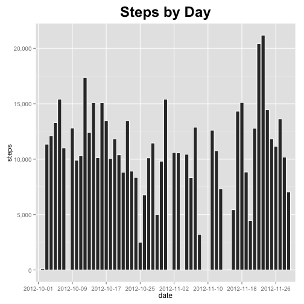
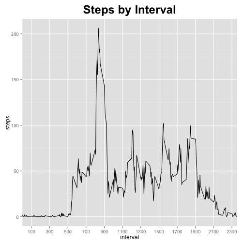
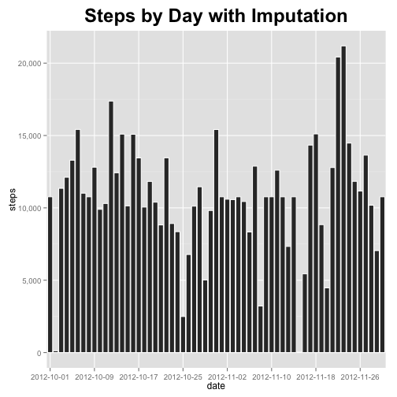
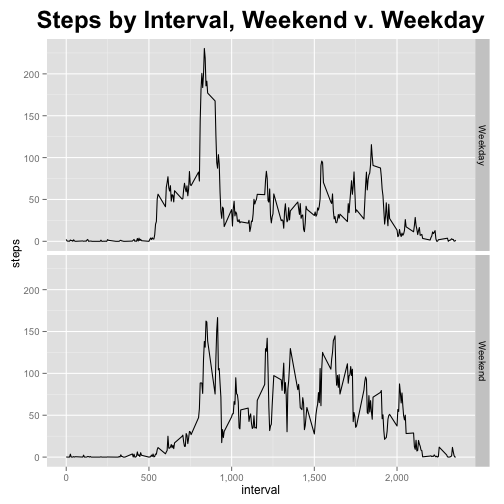

# Reproducible Research: Peer Assessment 1


## Loading and preprocessing the data

First, let's load in a few libraries and read in the data.


```r
if (!require(ggplot2)) {
    install.packages("ggplot2")
    library(ggplot2)
}
```

```
## Loading required package: ggplot2
```

```r

if (!require(plyr)) {
    install.packages("plyr")
    library(plyr)
}
```

```
## Loading required package: plyr
```

```r

if (!require(scales)) {
    install.packages("scales")
    library(scales)
}
```

```
## Loading required package: scales
```

```r

data <- read.csv(unz("activity.zip", "activity.csv"))
```


## What is mean total number of steps taken per day?

Let's plot the total number of steps per day:  

```r
steps <- ddply(data, "date", summarise, steps = sum(steps, na.rm = TRUE))

ggplot(steps, aes(x = date, y = steps)) + geom_bar(stat = "identity", color = "white") + 
    scale_x_discrete(breaks = factor(steps$date)[seq(1, length(steps$date), 
        by = 8)]) + scale_y_continuous(labels = comma) + ggtitle("Steps by Day") + 
    theme(plot.title = element_text(size = rel(2), face = "bold", vjust = 1.5))
```

 


Let's find the mean and median per day:  

```r
stepMean <- mean(steps$steps)
stepMedian <- median(steps$steps)
```


The mean number of steps per day is 9354.2295.
The median number of steps per day is 10395.

## What is the average daily activity pattern?

Let's plot the average number of steps per interval:  

```r
intervals <- ddply(data, "interval", summarise, steps = mean(steps, na.rm = TRUE))

ggplot(intervals, aes(x = interval, y = steps)) + geom_line(stat = "identity") + 
    scale_x_discrete(breaks = factor(seq(100, max(intervals$interval), by = 200))) + 
    scale_y_continuous(labels = comma) + ggtitle("Steps by Interval") + theme(plot.title = element_text(size = rel(2), 
    face = "bold", vjust = 1.5))
```

 

```r

maxInt <- intervals[intervals$steps == max(intervals$steps), "interval"]
```


The interval with the maximum average number of daily steps is interval 835.

## Imputing missing values

```r
numMissing <- sum(is.na(data$steps))
```


There are 2304 missing values in the dataset.

We will impute missing values with the average number of steps *for that interval* across all days, and then plot the resulting histogram.


```r
data2 <- merge(data, rename(intervals, c(steps = "steps2")))
stepsNA <- which(is.na(data2$steps))
data2$steps[stepsNA] <- data2$steps2[stepsNA]

steps2 <- ddply(data2, "date", summarise, steps = sum(steps, na.rm = TRUE))

ggplot(steps2, aes(x = date, y = steps)) + geom_bar(stat = "identity", color = "white") + 
    scale_x_discrete(breaks = factor(steps2$date)[seq(1, length(steps2$date), 
        by = 8)]) + scale_y_continuous(labels = comma) + ggtitle("Steps by Day with Imputation") + 
    theme(plot.title = element_text(size = rel(2), face = "bold", vjust = 1.5))
```

 


Let's find the mean and median per day this time:  

```r
stepMean2 <- mean(steps2$steps)
stepMedian2 <- median(steps2$steps)
```


The new mean number of steps per day is 1.0766 &times; 10<sup>4</sup>.  
The new median number of steps per day is 1.0766 &times; 10<sup>4</sup>.  
Both of these values *increased* by imputing missing values with the average number of steps for that interval.  
Unsurprisingly, there are *more steps per day* after imputing missing values.  

## Are there differences in activity patterns between weekdays and weekends?

Let's plot the difference: 

```r
data2$weekdays <- factor(sapply(weekdays(as.Date(data2$date)), switch, Saturday = "Weekend", 
    Sunday = "Weekend", "Weekday"))

intervals2 <- ddply(data2, .(interval, weekdays), summarise, steps = mean(steps, 
    na.rm = TRUE))

ggplot(intervals2, aes(x = interval, y = steps)) + geom_line(stat = "identity") + 
    scale_x_continuous(labels = comma) + ggtitle("Steps by Interval, Weekend v. Weekday") + 
    theme(plot.title = element_text(size = rel(2), face = "bold", vjust = 1.5)) + 
    facet_grid(weekdays ~ .)
```

 


